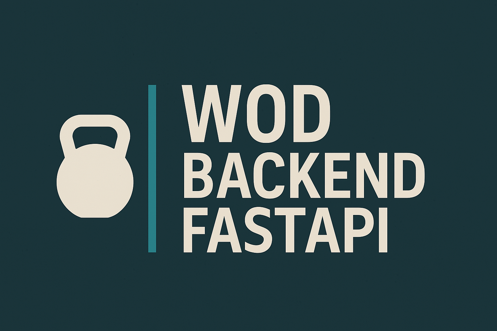

<p align="center">
  
</p>

# 🏋️‍♀️ Academia CrossFit API

Sistema de gestão de atletas e categorias para uma academia de CrossFit, construído com **FastAPI**, **SQLite** e **Alembic**.

## 🚀 Tecnologias utilizadas

- Python 3.11+
- FastAPI
- SQLite
- Alembic
- SQLAlchemy
- Uvicorn

## 📦 Como rodar o projeto

1. Clone o repositório:

```bash
git clone https://github.com/seu-usuario/atletas-em-acao.git
cd atletas-em-acao
